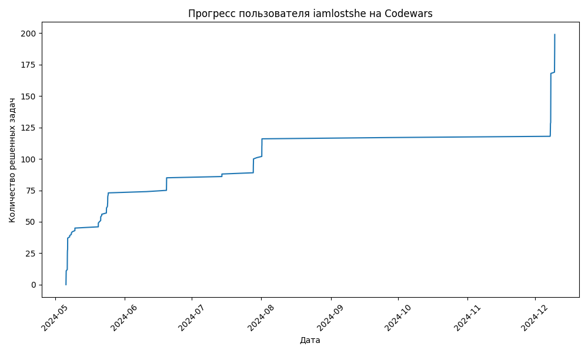

# CODEWARS-PROGRESS

Бот для отслеживания прогресса на codewars.com

### Установка / Installation

1. **Клонируем репозиторий:**

``` bash
git clone https://github.com/iamlostshe/CODEWARS-PROGRESS
```

2. **Переходим в дирректорию с проектом:**

``` bash
cd CODEWARS-PROGRESS
```

3. **Устанавливаем необходимые зависимости:**

``` bash
pip install -r requirements.txt
```

> Если вы под Linux-ом не забудьте создать виртуальное окружение
> ``` bash
> python -m venv venv
> . venv/bin/activate
> ```

4. **Заполняем поля в `.env.dist` и переименовываем его в `.env`**

5. **Запуск бота**
```
python3 bot.py
```

### Структура проекта

```
requirements.txt - зависимости проекта
bot.py           - файл запуска бота
utils            - утилиты
handlers         - хендлеры
.env             - файл с токеном
```


